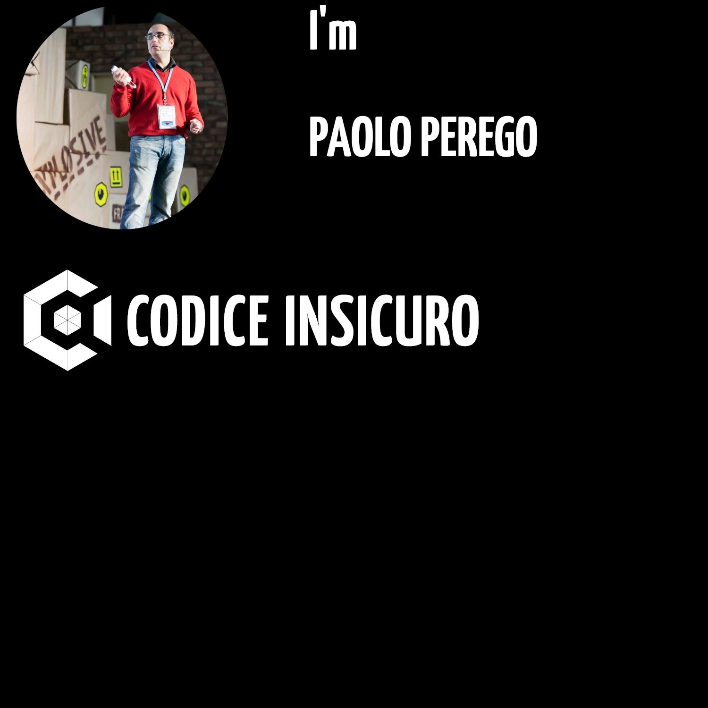

<!--
    Inspired by https://raw.githubusercontent.com/braydoncoyer/braydoncoyer/main/README.md
-->

Hi there 👋

I'm Paolo, a senior application security engineer. After some time spent doing
penetration tests, I'm now focused on security code reviews and software
architectural audit for [SUSE Linux](https://www.suse.com).
I love writing code and applying TDD and BDD with secure bonding principle and
I wrote also a static code analyzer for ruby written applications,
[dawnscanner](https://github.com/thesp0nge/dawnscanner).

## 📝 Latest Blog Posts
<!-- BLOG-POST-LIST:START -->
- [Sono tutti open con il source degli altri – reprise](https://codiceinsicuro.it/2022/05/10/sono-tutti-open-con-il-source-degli-altri-reprise/)
- [Password vs Passphrase: la cracking challenge](https://codiceinsicuro.it/2022/04/21/password-vs-passphrase-la-cracking-challenge/)
- [Non mettete regole troppo complesse alle vostre password](https://codiceinsicuro.it/2022/04/16/non-mettete-regole-troppo-complesse-alle-vostre-password/)
- [E se la soluzione al problema dell’antivirus fosse avere il codice open?](https://codiceinsicuro.it/2022/04/04/e-se-il-problema-dell-antivirus-fosse-avere-il-codice-open/)
- [Facciamo behavior-driven development con il C](https://codiceinsicuro.it/2022/04/01/facciamo-behavior-driven-development-con-il-c/)
<!-- BLOG-POST-LIST:END -->

<!--
**thesp0nge/thesp0nge** is a ✨ _special_ ✨ repository because its `README.md` (this file) appears on your GitHub profile.

Here are some ideas to get you started:

- 🔭 I’m currently working on ...
- 🌱 I’m currently learning ...
- 👯 I’m looking to collaborate on ...
- 🤔 I’m looking for help with ...
- 💬 Ask me about ...
- 📫 How to reach me: ...
- 😄 Pronouns: ...
- ⚡ Fun fact: ...
-->
