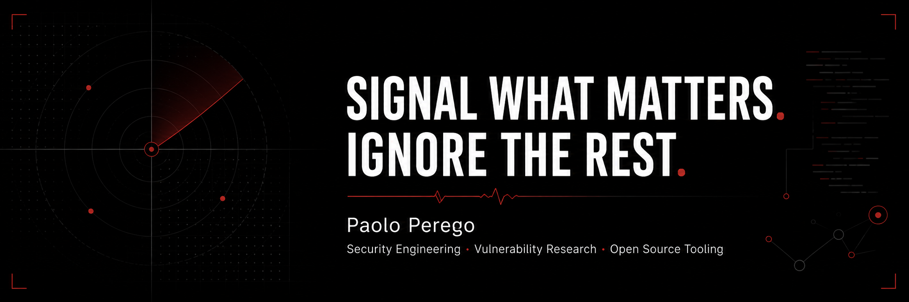

  

# Paolo Perego

### Application & Product Security Engineer

**I read code, break assumptions and build open-source security tooling.**

`Code Review` · `Vulnerability Research` · `Static Analysis` · `Security Tooling`

---

> **Security doesn't need more findings.**  
> It needs better signal, better context and better engineering judgment.

 

## 👋 About me

I've spent more than two decades working where **software engineering and security meet**.

I like security when it gets close to the code: reviewing it, understanding how it can fail, validating vulnerabilities and building tools that help engineers make better security decisions.

My main interests are:

- 🔍 Application & Product Security
- 🧬 Security-focused code review
- 🎯 Vulnerability research
- 🌳 Static analysis and data-flow analysis
- 🛠️ Open-source security tooling
- 🤖 AI-assisted vulnerability research
- 🧠 Turning security noise into actionable signal

 

## 🛠️ Things I build

<table>
<tr>
<td width="50%" valign="top">

### 🔬 DRSource

**Follow untrusted data through real code.**

A multi-language static analysis engine focused on security-relevant data flows, inter-file taint tracking and contextual vulnerability analysis.

`SAST` `Tree-sitter` `Taint Analysis` `SARIF`

</td>

<td width="50%" valign="top">

### 📡 Signal Engine

**Turn security findings into signal.**

A security intelligence engine that normalizes, deduplicates, clusters and prioritizes findings from multiple security tools.

`Security Automation` `SARIF` `Clustering` `Risk Analysis`

</td>
</tr>

<tr>
<td width="50%" valign="top">

### 🕷️ Nightcrawler

**From suspicious traffic to validated findings.**

A mitmproxy-based security researcher's sidekick for passive analysis, targeted active testing, confidence scoring and reproducible PoCs.

`Web Security` `mitmproxy` `Dynamic Analysis` `PoC`

</td>

<td width="50%" valign="top">

### 🌅 Dawnscanner

**Where my security tooling journey started.**

An open-source static analysis security scanner for Ruby web applications.

Built years ago. Still one of the projects that best represents how I think about security: get close to the code and give developers useful information.

`Ruby` `SAST` `Application Security` `Open Source`

</td>
</tr>
</table>

 

## 🧭 What I'm exploring now

I'm particularly interested in the space between **finding something suspicious** and being able to say:

> _"Yes. This is actually a vulnerability, this is why it matters, and this is what we should do about it."_

That means exploring areas such as:

- inter-procedural and inter-file source analysis
- vulnerability validation
- security finding correlation
- confidence scoring
- developer-centric security workflows
- AI-assisted security research
- reducing false positives without losing meaningful signal

 

## ✍️ Writing

### Armored Code

My English-language technical home for:

**Application Security · Vulnerability Research · Code Review · Security Tooling**

A recurring theme in my work is simple:

> **Signal what matters. Ignore the rest.**

### Codice Insicuro

My long-running Italian publication about secure development, code review, cybersecurity and software security.

 

## 🎙️ Security Walks

I also host **Security Walks**, a short-form Italian cybersecurity podcast covering vulnerabilities, security news and technology without unnecessary noise.

 

## 🌍 Open source

I've been contributing to and building open-source software for a large part of my career.

I believe security tooling works best when engineers can:

1. understand what the tool is doing;
2. challenge its assumptions;
3. reproduce its findings;
4. improve it.

That's one of the reasons I keep building in public.

 

---

### Security is not about generating more alerts.

**It's about understanding which ones matter.**

`Application Security` · `Vulnerability Research` · `Open Source`

## 📝 Latest Blog Posts
<!-- BLOG-POST-LIST:START -->
- [Is Your Product Security Engineer Going to Be Replaced?](https://armoredcode.com/blog/is-your-product-security-engineer-going-to-be-replaced/)
- [NGINX PoolSlip &amp;amp; NGINX Rift: When the Internet’s Favorite Reverse Proxy Turns Against Itself](https://armoredcode.com/blog/nginx-poolslip-nginx-rift-reverse-proxy-rce/)
- [Signal Engine 0.3.0: From Raw Findings to Real Signal](https://armoredcode.com/blog/signal-engine-0.3.0-from-findings-to-signal/)
- [Soak: Deep-Tissue Static Analysis as an Execution Layer](https://armoredcode.com/blog/soak-deep-tissue-static-analysis-as-an-execution-layer/)
- [Aggregating Semgrep Results: Top Rules, Files, and Clusters &lpar;MVP Demo&rpar;](https://armoredcode.com/blog/aggregating-semgrep-results-mvp-demo/)
<!-- BLOG-POST-LIST:END -->

<!--
**thesp0nge/thesp0nge** is a ✨ _special_ ✨ repository because its `README.md` (this file) appears on your GitHub profile.

Here are some ideas to get you started:

- 🔭 I’m currently working on ...
- 🌱 I’m currently learning ...
- 👯 I’m looking to collaborate on ...
- 🤔 I’m looking for help with ...
- 💬 Ask me about ...
- 📫 How to reach me: ...
- 😄 Pronouns: ...
- ⚡ Fun fact: ...
-->
